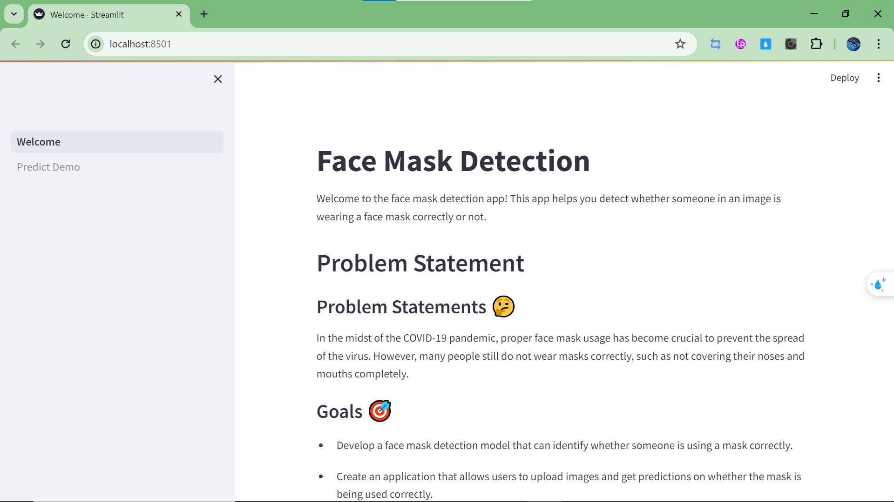
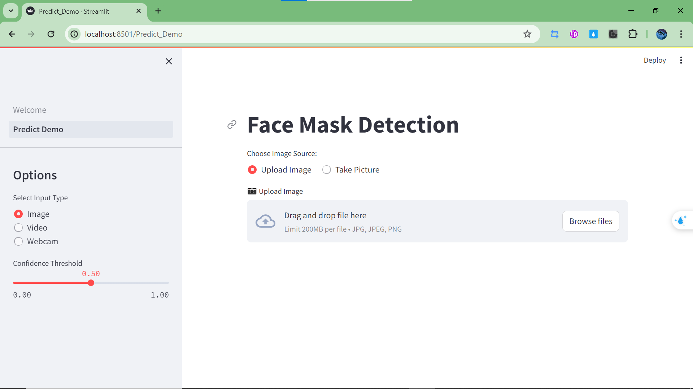
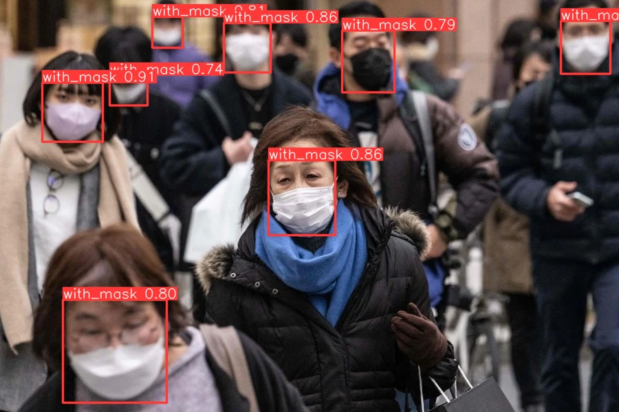
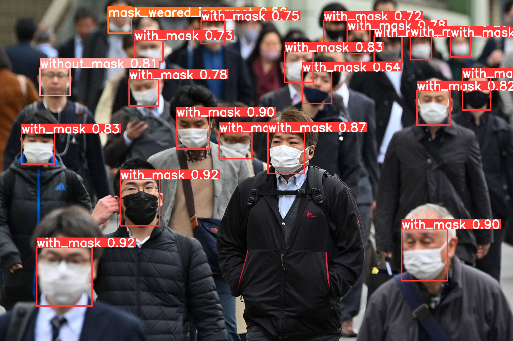

# Real-Time Face Mask Detection with Streamlit and YOLOv8

#### Demo Link: [FaceMask-Detection](https://facemask-detection-82rvznihkuz6cpffsrl4ay.streamlit.app/)

# How to Run Locally
## System Requirements
- **Operating System:** Windows, MacOS, or Linux
- **Python 3.10**
- **Git**
- **Disk Space:** At least 3GB of available disk space

## Pre-Installation Checks

1. **Check Python Installation:**
   - Open Command Prompt (cmd).
   - Check if Python is installed by running:
     
    ```bash
    python --version
    ```
     
   - If Python is not installed, download and install from [python.org](https://www.python.org/downloads/). Make sure to choose a version compatible with your operating system.

2. **Check Git Installation:**
   - Check if Git is installed by running:
     ```bash
     git --version
     ```
   - If Git is not installed, download and install from [git-scm.com](https://git-scm.com/downloads/).

## Installation Steps

### 3. Navigate to Project Folder via Command Prompt:
   - Change the current directory to your project folder using the cd command.

### 4. Create Virtual Environment and Project Folder:
   - Create a new folder named "facemaskdetection-project" using the following command:
     ```bash
     mkdir facemaskdetection-project
     ```
   - Navigate to the "facemaskdetection-project" folder:
     ```bash
     cd facemaskdetection-project
     ```
   - Create a new Python virtual environment named "facemaskEnv" using the following command:
     ```bash
     python -m venv facemaskEnv 
     ```
     or 
     ```bash
     py -m venv facemaskEnv
     ```
     - Activate the virtual environment:
       - On Windows:
         ```bash
         .\facemaskEnv\Scripts\activate
         ```
       - On MacOS/Linux:
         ```bash
         source facemaskEnv/bin/activate
         ```

Now you have set up the project folder named "facemaskdetection-project" with a Python virtual environment named "facemaskEnv". Next, proceed with the remaining installation steps within this project folder.

### 5. Clone Project Files:
   - Clone the project repository containing notebook files, models, and Streamlit script from GitHub with the following command:
     ```bash
     git clone https://github.com/dinosptr/facemask-detection.git
     ```
   - Navigate to the cloned repository folder:
     ```bash
     cd facemask-detection
     ```

### 6. Install Project Dependencies:
   - Install the project's required dependencies using pip and the provided requirements.txt file:
     ```bash
     pip install -r requirements.txt
     ```

### 7. Run the Streamlit App:
To launch the Streamlit application, execute the following command in the project directory:


```bash
streamlit run Welcome.py

```
After the command to run the Streamlit script, a new line is added informing the user that they will be directed to open the app in their web browser at localhost:8501.

### 8. Tampilan Website



# Contoh output Image


